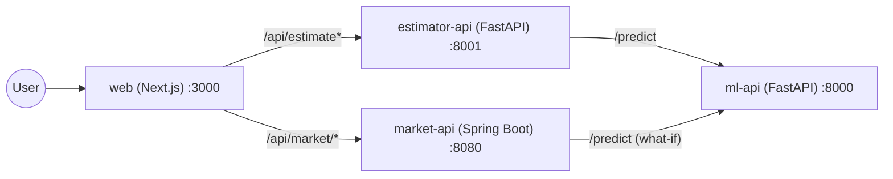

# Housing Price Prediction Platform

A full-stack housing price prediction and market analytics platform built for the take-home task. It combines a machine-learning prediction API, a property value estimator service, a market analytics service, and a Next.js frontend that ties them all together.

## Overview

The platform is split into four independently runnable services:

| Service | Tech | Port | Purpose |
|---|---|---|---|
| [`ml-api`](services/ml-api) | Python · FastAPI · scikit-learn | `8000` | Trains and serves a `LinearRegression` model that predicts house prices from 7 property features. |
| [`estimator-api`](services/estimator-api) | Python · FastAPI | `8001` | Property value estimator — calls `ml-api`, records estimate history, and supports side-by-side comparisons. |
| [`market-api`](services/market-api) | Java 21 · Spring Boot | `8080` | Market analytics over the housing dataset — summaries, filtered property listings, "what-if" pricing (via `ml-api`), CSV/PDF export. |
| [`web`](web) | Next.js 16 · React 19 · TypeScript · Tailwind CSS | `3000` | Frontend UI — Value Estimator and Market Explorer pages, proxying to the three backend APIs through Next.js API routes. |

### Architecture



## Tech stack

- **Machine learning:** Python 3.12, scikit-learn (`LinearRegression`), pandas, joblib
- **APIs (Python):** FastAPI, Pydantic, uvicorn — `ml-api`, `estimator-api`
- **API (Java):** Java 21, Spring Boot, Maven — `market-api`
- **Frontend:** Next.js 16 (App Router), React 19, TypeScript, Tailwind CSS
- **Tooling:** `uv` (Python dependency + venv management), Docker, pytest

## Repository structure

```
Housing_Price_Predict_Task/
├── dataset/                      # Raw dataset used for testing/prediction
├── docs/                         # Service-level run guides
├── services/
│   ├── ml-api/                   # Prediction API (trains + serves the model)
│   ├── estimator-api/            # Property value estimator (calls ml-api)
│   └── market-api/               # Market analytics API (Java/Spring Boot)
├── web/                          # Next.js frontend
├── pyproject.toml / uv.lock       # Shared Python dependency lockfile (repo root)
└── README.md
```

## Prerequisites

| Tool | Needed for | Check |
|---|---|---|
| Python 3.12+ | `ml-api`, `estimator-api` | `python --version` |
| [uv](https://docs.astral.sh/uv/getting-started/installation/) | Python dependency management | `uv --version` |
| Java 21+ & Maven | `market-api` | `java --version`, `mvn --version` |
| Node.js 20+ | `web` frontend | `node --version` |
| Docker Desktop *(optional)* | Containerised run | `docker --version` |

---

## Running locally (without Docker)

Run each service in its own terminal, in this order (ml-api first, since the others depend on it).

### 1. Install Python dependencies (repo root)

```bash
git clone https://github.com/AjayJangid17/Housing_Price_Predict_Task.git
cd Housing_Price_Predict_Task
uv sync
```

This creates a `.venv` at the repo root shared by both Python services.

### 2. `ml-api` — train + serve (port 8000)

```bash
cd services/ml-api
python -m app.train              # trains the model -> models/model.joblib
uvicorn app.main:app --reload --port 8000
```
Docs: http://127.0.0.1:8000/docs

### 3. `estimator-api` — serve (port 8001)

```bash
cd services/estimator-api
uvicorn app.main:app --reload --port 8001
```
Docs: http://127.0.0.1:8001/docs

By default it calls `ml-api` at `http://localhost:8000`. Override with `ML_API_URL` if needed.

### 4. `market-api` — serve (port 8080)

```bash
cd services/market-api
mvn spring-boot:run
```
Requires `ml-api` running at `http://localhost:8000` for the `/market/what-if` endpoint.

### 5. `web` — frontend (port 3000)

```bash
cd web
npm install
npm run dev
```
Open http://localhost:3000.

The frontend defaults to calling the backends on their local ports (`8000`, `8001`, `8080`). Override with `ML_API_URL`, `ESTIMATOR_API_URL`, `MARKET_API_URL` env vars if running on different hosts/ports.

---

## Running with Docker

The simplest way to run the whole platform is with the root [`docker-compose.yml`](docker-compose.yml), which builds and starts all four services together, wired to talk to each other automatically.

```bash
docker compose up --build
```

This will:
- Build and start `ml-api` on http://localhost:8000 (trains the model at build time)
- Build and start `estimator-api` on http://localhost:8001 (points at `ml-api` internally)
- Build and start `market-api` on http://localhost:8080 (points at `ml-api` internally)
- Build and start `web` on http://localhost:3000 (points at all three APIs internally)

Once it's up, open **http://localhost:3000** — that's the only URL you need for the demo.

Stop everything with:

```bash
docker compose down
```

### Running services individually (advanced / no compose)

Each backend service also has its own standalone `Dockerfile` if you want to build and run them one at a time on a manually created network:

```bash
# 1. Build images
cd services/ml-api        && docker build -t ml-api .        && cd ../..
cd services/estimator-api && docker build -t estimator-api . && cd ../..
cd services/market-api    && docker build -t market-api .    && cd ../..
cd web                    && docker build -t web .           && cd ..

# 2. Create a shared network
docker network create housing

# 3. Run ml-api (trains the model at build time)
docker run -d --name ml-api --network housing -p 8000:8000 ml-api

# 4. Run estimator-api, pointing at ml-api by container name
docker run -d --name estimator-api --network housing -p 8001:8000 \
  -e ML_API_URL=http://ml-api:8000 estimator-api

# 5. Run market-api, pointing at ml-api by container name
docker run -d --name market-api --network housing -p 8080:8080 \
  -e ML_API_URL=http://ml-api:8000 market-api

# 6. Run web, pointing at all three by container name
docker run -d --name web --network housing -p 3000:3000 \
  -e ML_API_URL=http://ml-api:8000 \
  -e ESTIMATOR_API_URL=http://estimator-api:8000 \
  -e MARKET_API_URL=http://market-api:8080 \
  web
```

### Cleanup

```bash
# docker compose
docker compose down

# manual network
docker rm -f ml-api estimator-api market-api web
docker network rm housing
```

---

## API endpoints

**`ml-api`** (`:8000`)
- `GET /health` — liveness check
- `POST /predict` — predict price for one property
- `POST /predict/batch` — predict prices for multiple properties
- `GET /model-info` — model coefficients + metrics

**`estimator-api`** (`:8001`)
- `GET /health`
- `POST /estimate` — single property estimate (records history)
- `POST /estimate/compare` — compare multiple properties
- `GET /estimate/history` — past estimates

**`market-api`** (`:8080`)
- `GET /health`
- `GET /market/summary` — aggregated market statistics
- `GET /market/properties` — filtered/sorted property listing
- `POST /market/what-if` — hypothetical property pricing (via `ml-api`)
- `GET /market/export` — CSV/PDF export of filtered properties

## Frontend features

- **Value Estimator** (`/estimator`) — submit a property, get a predicted price, view a paginated estimate history table and a price comparison chart.
- **Market Explorer** (`/market`) — browse and filter the housing dataset, view market summary stats, run what-if pricing, and export results.

## Testing

```bash
cd services/ml-api
python -m pytest -v
```

## Further reading

- [docs/task1-ml-api.md](docs/task1-ml-api.md) — detailed `ml-api` guide, model notes, troubleshooting
- [docs/market-api.md](docs/market-api.md) — detailed `market-api` guide with request/response examples
- [docs/how-to-run-project.md](docs/how-to-run-project.md) — quick command reference for all services
